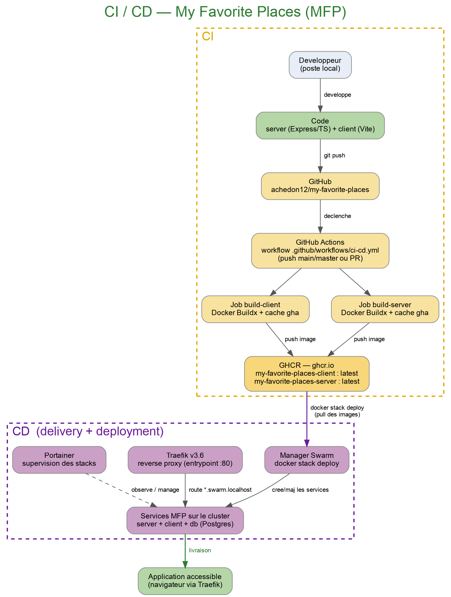

# Documentation — My Favorite Places (MFP)

Documentation du déploiement de la solution (CI / CD + infra Docker Swarm).

## 1. L'application

3 services :

- **client** : interface (Vite + nginx), écoute sur le port `80`, sert le site et proxy les appels `/api/` vers le server.
- **server** : API (Express / TypeScript), écoute sur le port `3000`, se connecte à la base.
- **db** : PostgreSQL 15 (user `postgres`, password `supersecret`, base `postgres`).

Le code est sur GitHub : `achedon12/my-favorite-places`.

## 2. Schéma CI / CD



# 3. Travailler en local

1. Cloner le repo :
   ```bash
   git clone https://github.com/achedon12/my-favorite-places.git
   cd my-favorite-places/favorites-places
   ```

2. Lancer toute l'app en local (build des images depuis le code) :
   ```bash
   docker compose up --build -d
   ```

3. Accéder à l'app :
   - client : http://localhost:801
   - API : http://localhost:3000/api
   - test simple : http://localhost:3000/bonjour

4. Arrêter :
   ```bash
   docker compose down
   ```

# 4. Reproduire la production en local

Même app, mais avec les **images publiées par la CI** (aucun build, que `image:`) :

```bash
docker compose -f docker-compose.image.yml up -d
```

> Les images viennent de GHCR : `ghcr.io/achedon12/my-favorite-places-server:latest` et `...-client:latest`.

# 5. Les flows (CI)

Déclencheurs (dans `.github/workflows/ci-cd.yml`) :

- `git push` sur `main` / `master` → build + **push** des images sur GHCR.
- Pull Request vers `main` / `master` → build des images pour vérifier que ça compile (pas de push).

Le workflow a 2 jobs en parallèle :

- `build-client` : build l'image du client avec Docker Buildx.
- `build-server` : build l'image du server avec Docker Buildx.

# 6. Effets de bord des flows

- À chaque push sur `main`, 2 nouvelles images sont **poussées sur GHCR** (registry `ghcr.io`).
- Tags posés : `latest` + un tag basé sur le commit (`main-<sha>`).
- Un cache de build (`type=gha`) est stocké pour accélérer les builds suivants.

# 7. Les environnements

- **Local** : développer et tester → `docker compose up --build`.
- **CI** (GitHub Actions) : builder et publier les images → automatique au push.
- **Prod** (Docker Swarm) : faire tourner l'app sur le cluster → `docker stack deploy`.

# 8. Monter le cluster Docker Swarm (ansible-demo)

On simule un cluster avec 1 manager et 3 nodes (depuis le dossier `ansible-demo/`).

1. Lancer le manager et les 3 nodes :
   ```bash
   docker compose up --scale manager=1 --scale node=3 -d
   ```

2. Initialiser le swarm sur le manager :
   ```bash
   docker exec ansible-demo-manager-1 docker swarm init
   ```

3. Joindre les 3 nodes au manager (token donné par la commande `swarm init`, IP du manager = `172.80.11.3`) :
   ```bash
   docker exec ansible-demo-node-1 docker swarm join --token <TOKEN> 172.80.11.3:2377
   docker exec ansible-demo-node-2 docker swarm join --token <TOKEN> 172.80.11.3:2377
   docker exec ansible-demo-node-3 docker swarm join --token <TOKEN> 172.80.11.3:2377
   ```

4. Vérifier que les nodes sont dans le cluster :
   ```bash
   docker exec ansible-demo-manager-1 docker node ls
   ```

# 9. Déployer la stack (Traefik + Portainer + app)

1. Créer le réseau overlay de Traefik (une seule fois) :
   ```bash
   docker exec ansible-demo-manager-1 docker network create -d overlay --attachable web
   ```

2. Déployer la stack (Traefik + Portainer + services) :
   ```bash
   docker exec -i ansible-demo-manager-1 docker stack deploy -c - traefik < ansible-demo/traefik/stacks/traefik-stack.yml
   ```

3. Vérifier que tout tourne :
   ```bash
   docker exec ansible-demo-manager-1 docker stack services traefik
   ```

4. Mettre à jour le `/etc/hosts` puis ouvrir dans le navigateur :
   ```bash
   echo "127.0.0.1 traefik.swarm.localhost" | sudo tee -a /etc/hosts
   echo "127.0.0.1 portainer.swarm.localhost" | sudo tee -a /etc/hosts
   echo "127.0.0.1 whoami.swarm.localhost" | sudo tee -a /etc/hosts
   echo "127.0.0.1 vote.swarm.localhost" | sudo tee -a /etc/hosts
   echo "127.0.0.1 result.swarm.localhost" | sudo tee -a /etc/hosts
   echo "127.0.0.1 api_mfp.swarm.localhost" | sudo tee -a /etc/hosts
   ```
   - Traefik : http://traefik.swarm.localhost
   - Portainer : http://portainer.swarm.localhost
   - Whoami : http://whoami.swarm.localhost
   - Vote : http://vote.swarm.localhost
   - Result : http://result.swarm.localhost
   - api_mfp : http://api_mfp.swarm.localhost

> Traefik route les services via les URLs `*.swarm.localhost`. Portainer permet de superviser les stacks.


# 10. Ce que le dev doit surveiller

- Toujours travailler sur une branche, puis Pull Request : la PR build les images sans les publier.
- Un merge / push sur `main` publie automatiquement de nouvelles images `latest`.
- Vérifier que le pipeline GitHub Actions est **vert** avant de déployer.
- Ne pas mettre de secret en clair dans les fichiers (mots de passe DB = démo uniquement).

# 11. Pour déployer des stacks sur portainer :

1. Se connecter à Portainer (http://portainer.swarm.localhost, admin / password).
2. Aller dans "Stacks" → "Add stack".
3. Donner un nom à la stack, puis creer votre stack comme ceci :
    ```yaml
    services:
    
      db:
        image: postgres:15
        environment:
          POSTGRES_USER: postgres
          POSTGRES_PASSWORD: supersecret
          POSTGRES_DB: postgres
        ports:
          - "5432:5432"
        volumes:
          - db-data:/var/lib/postgresql/data
        networks:
          - web
          - api_mfp
        deploy:
          replicas: 1
          placement:
            constraints:
              - node.role == manager
    
      server:
        image: ghcr.io/achedon12/my-favorite-places-server:latest
        ports:
          - 3000:3000
        depends_on:
          - db
        networks:
          - web
          - api_mfp
        deploy:
          replicas: 1
          placement:
            constraints:
              - node.role == manager
          labels:
            - "traefik.enable=true"
            - "traefik.http.routers.result.rule=Host(`api_mfp.swarm.localhost`)"
            - "traefik.http.routers.result.entrypoints=web"
            - "traefik.http.services.result.loadbalancer.server.port=3000"
    
    networks:
      web:
        external: true
      api_mfp:    
          driver: overlay
    
    volumes:
      db-data:
    ```
4. Cliquer sur "Deploy the stack" et vérifier que les services sont bien créés.
5. Accéder à l'API : http://api_mfp.swarm.localhost/api et http://api_mfp.swarm.localhost/bonjour

Exercices non traités : 

- Exercice 2 (Shepherd)