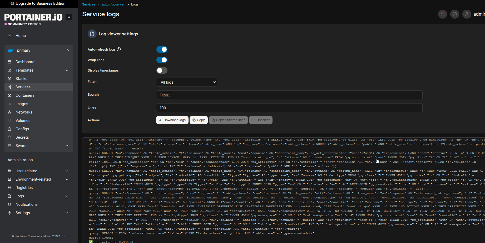
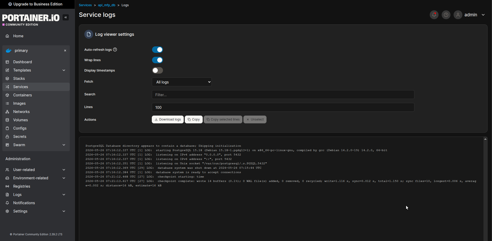
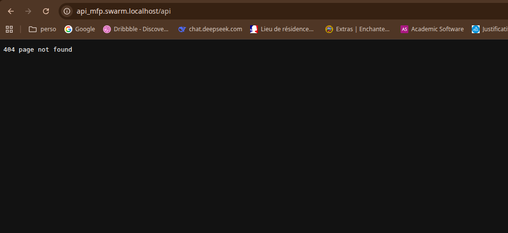

# Exercice 1

1. Lancer le docker compose avec une configuration de 1 manager et 3 workers :
   ```bash
     docker compose up --scale manager=1 --scale node=3 -d
   ```

2. init le swarm cluster et joindre les nodes au manager :
   ```bash
      docker exec ansible-demo-manager-1 docker swarm init
   ```
   
3. ajouter les nodes au cluster :
   ```bash
   docker exec ansible-demo-node-1 docker swarm join --token SWMTKN-1-26nnxx8xx7b3kl9o8szwkeb599oz5zsfcbmhwbwdq5e5oppuim-64j9zro0ynztepa5rycysxk52 172.80.11.3:2377
   docker exec ansible-demo-node-2 docker swarm join --token SWMTKN-1-26nnxx8xx7b3kl9o8szwkeb599oz5zsfcbmhwbwdq5e5oppuim-64j9zro0ynztepa5rycysxk52 172.80.11.3:2377
   docker exec ansible-demo-node-3 docker swarm join --token SWMTKN-1-26nnxx8xx7b3kl9o8szwkeb599oz5zsfcbmhwbwdq5e5oppuim-64j9zro0ynztepa5rycysxk52 172.80.11.3:2377
   ```
   
   > docker exec ansible-demo-manager-1 docker node ls
   > Commande pour vérifier que les nodes sont bien dans le cluster

4. Ajouter l'overlay network pour traefik :
   ```bash
     docker exec ansible-demo-manager-1 docker network create -d overlay --attachable web
   ```

5. Déployer la stack traefik :
   ```bash
   docker exec -i ansible-demo-manager-1 docker stack deploy -c - traefik < traefik/stacks/traefik-stack.yml
   ```
   
6. Vérifier que les services sont en cours d'exécution :
   ```bash
     docker exec ansible-demo-manager-1 docker stack services traefik
   ```

# Exercice 2 et 3

Rajouté dans treafik-stack.yml

# Exercice 1

ajout de la route /bonjour dans le dossier [favorites-places](../favorites-places)

ajout du nouveau docker compose dans le dossier [favorites-places](../favorites-places) 


```yaml
services:

  db:
    image: postgres:15
    environment:
      POSTGRES_USER: postgres
      POSTGRES_PASSWORD: supersecret
      POSTGRES_DB: postgres
    ports:
      - "5432:5432"
    volumes:
      - db-data:/var/lib/postgresql/data
    networks:
      - web
      - api_mfp
    deploy:
      replicas: 1
      placement:
        constraints:
          - node.role == manager

  server:
    image: ghcr.io/achedon12/my-favorite-places-server:latest
    ports:
      - 3000:3000
    depends_on:
      - db
    networks:
      - web
      - api_mfp
    deploy:
      replicas: 1
      placement:
        constraints:
          - node.role == manager
      labels:
        - "traefik.enable=true"
        - "traefik.http.routers.result.rule=Host(`api_mfp.swarm.localhost`)"
        - "traefik.http.routers.result.entrypoints=web"
        - "traefik.http.services.result.loadbalancer.server.port=3000"

networks:
  web:
    external: true
  api_mfp:    
      driver: overlay

volumes:
  db-data:


```

# Exercice 2 : 

je ne suis pas allez jusqu'a Shepherds (exo 2) puisque mon http://api_mfp.swarm.localhost/bonjour ou http://api_mfp.swarm.localhost/api ne tourne pas 



